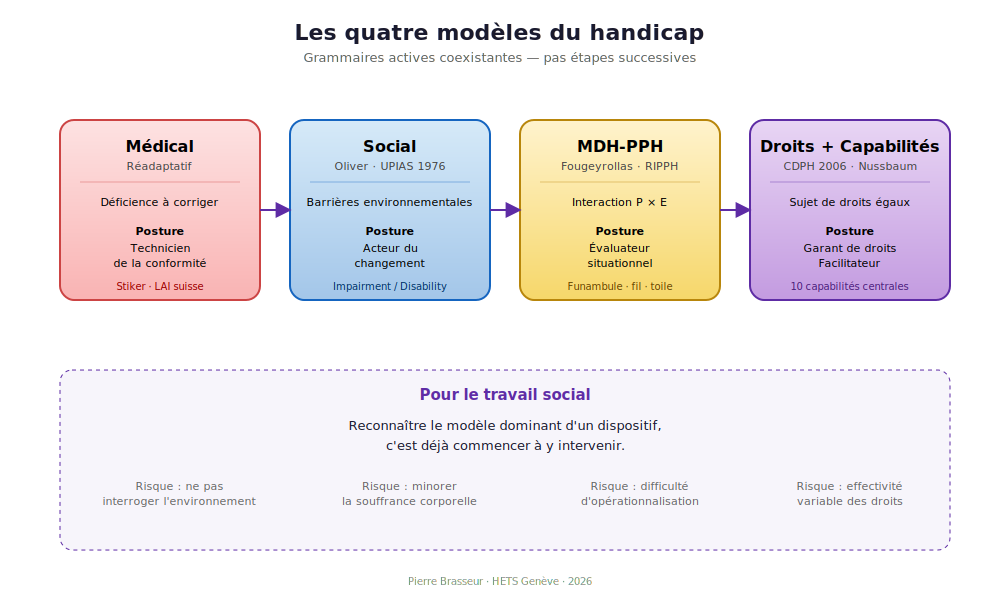

::: {.callout-tip icon=false appearance="default"}
## Au programme de cette séance

**Mouvement** · Cartographie théorique II
**Question structurante** · Comment articuler personne et environnement dans une grille opérationnelle ?
**Durée** · 2 heures
**Lecture estimée** · 35 minutes

Trois cadres convergents : le MDH-PPH québécois de Fougeyrollas, l'approche par les capabilités de Sen et Nussbaum, la CDPH ONU 2006. Application finale à la vignette de Léa avec les quatre modèles.

À la fin, vous saurez **mobiliser le MDH-PPH** sur une situation concrète, **identifier les dix capabilités centrales**, **articuler la CDPH** avec la pratique du TS.

**Slides** · [reveal.js de la séance 3](../slides/03-slides.qmd)
:::

## Objectifs d'apprentissage

À l'issue de cette séance, l'étudiant·e sera capable de :

1. Mobiliser le **MDH-PPH** pour analyser une situation concrète (facteurs personnels, environnementaux, habitudes de vie)
2. Identifier les **dix capabilités centrales** de Nussbaum et leur portée évaluative
3. Articuler le cadre normatif **CDPH ONU 2006** avec les pratiques quotidiennes du TS
4. Appliquer les **quatre modèles** du handicap à la vignette de Léa

Compétences PEC20 ciblées : **C1, C2, C3, C4, C7**.

## Plan minuté (2 h)

| Temps | Contenu | Activité |
|---|---|---|
| 0-10 min | Restitution des règlements analysés | Tour de table |
| 10-35 min | **MDH-PPH** : Fougeyrollas, RIPPH, métaphore du funambule | Exposé |
| 35-60 min | **Capabilités** : Sen, Nussbaum, dix capabilités centrales | Exposé |
| 60-80 min | **CDPH ONU 2006** : articles 12, 19, 24 ; ratification suisse 2014 | Exposé |
| 80-110 min | **Application à la vignette de Léa** : 4 modèles en action | Travail collectif |
| 110-120 min | Synthèse | Discussion |

## Cadre théorique

### Le MDH-PPH : un modèle interactif francophone

Patrick Fougeyrollas développe au Québec le **Modèle de Développement Humain – Processus de Production du Handicap** [@fougeyrollas2010], en collaboration avec le RIPPH (Réseau international du processus de production du handicap).

> *« Le handicap n'est pas une caractéristique de la personne mais le résultat contextuel d'une interaction. »*
>
> --- @fougeyrollas2010

Trois éléments interagissent :

| Élément | Catégorie | Exemples |
|---|---|---|
| Le **funambule** | Facteurs personnels | Systèmes organiques, aptitudes, identité |
| Le **fil** | Habitudes de vie | Activités courantes, rôles sociaux valorisés |
| La **toile** | Facteurs environnementaux | Politiques, aménagements, attitudes, technologies |

Une **situation de handicap** survient quand la qualité de la toile ne soutient pas le passage. Inversement, une **situation de participation sociale** survient quand la toile soutient.

L'outil opérationnel est la **MHAVIE** (Mesure des habitudes de vie). Diffusion romande : Manon Masse et son équipe HETS ont mobilisé ce modèle pour analyser 47 institutions romandes et environ 7 000 adultes avec déficience intellectuelle [@masse2018].

### L'approche par les capabilités

Amartya Sen [@nussbaum2006] propose une alternative aux théories de la justice fondées sur la distribution des ressources. Ce qui compte n'est pas ce que la personne *possède*, mais ce qu'elle peut **faire et être** — sa **capabilité** réelle.

Martha Nussbaum [@nussbaum2006] systématise pour les personnes handicapées. Elle propose **dix capabilités centrales** comme conditions d'une vie digne.

::: {.callout-note appearance="simple"}
## Les dix capabilités centrales de Nussbaum

1. Vie
2. Santé corporelle
3. Intégrité corporelle
4. Sens, imagination, pensée
5. Émotions
6. Raison pratique
7. **Affiliation** (vivre avec et pour les autres)
8. Autres espèces
9. **Jeu**
10. **Contrôle de son environnement** (politique et matériel)
:::

::: {.callout-tip appearance="simple"}
## Pour la pratique du TS
Un projet personnalisé évalue traditionnellement des « besoins » (manger, se laver, se déplacer). Une grille des capabilités évalue ce que la personne **peut être et faire** : a-t-elle accès à l'affiliation, au jeu, au contrôle de son environnement ?

Cette évaluation est plus exigeante. Elle est aussi plus respectueuse de la dignité de la personne.
:::

### CDPH ONU 2006 : le tournant des droits

La Convention relative aux droits des personnes handicapées (2006) consacre le passage d'une approche de protection à une approche de droits [@cdph2006]. Ratifiée par la Suisse le **15 avril 2014**, en vigueur 15 mai 2014.

Trois articles structurants :

| Article | Objet | Portée pour le TS |
|---|---|---|
| **Art. 12** | Capacité juridique universelle | Passage de la substitution au soutien à la décision |
| **Art. 19** | Vie autonome dans la communauté | Cadre de la désinstitutionnalisation |
| **Art. 24** | Éducation inclusive | Cadre de l'école inclusive |

> *« Reconnaissent que la notion de handicap évolue et que le handicap résulte de l'interaction entre des personnes présentant des incapacités et les barrières comportementales et environnementales qui font obstacle à leur pleine et effective participation à la société sur la base de l'égalité avec les autres. »*
>
> --- @cdph2006, Préambule (e)

### Application : la vignette de Léa

Léa, 22 ans, trisomie 21, à L'Atelier de la Fondation Ensemble à Genève, demande : *« Je veux un appartement à moi et un amoureux qui dort là. »* Sa mère demande à l'équipe de la *« raisonner »*.

Application des quatre modèles :

| Modèle | Lecture de la situation | Action suggérée |
|---|---|---|
| Médical | Diagnostic à évaluer, demande à « raisonner » | Bilan cognitif et fonctionnel |
| Social | Cadre institutionnel inadapté à l'habitat individuel | Transformer les dispositifs |
| MDH-PPH | Habitudes de vie compromises par l'environnement | Cartographier obstacles/facilitateurs |
| Droits + capabilités | Capabilités d'affiliation et de contrôle à soutenir | Mobiliser CDPH art. 12, 19, 22 et contribution d'assistance |

::: {.callout-warning appearance="simple"}
## Important
Aucune lecture n'est *fausse*. Chacune est **incomplète**. La posture professionnelle consiste à mobiliser plusieurs grammaires simultanément, en explicitant ce que chaque modèle éclaire et ce qu'il occulte.
:::

## Lectures préparatoires (*jigsaw*)

::: panel-tabset

### Groupe A — MDH-PPH

[@fougeyrollas2010], **chapitres 2 et 4** (40 pages). [@masse2018], **introduction et chapitre 1** (30 pages).

### Groupe B — Capabilités

[@nussbaum2006], **introduction et chapitre 2** (45 pages, version française).

Bonvin & Farvaque (2008), *Amartya Sen. Une politique de la liberté*, chap. 1 et 4 (30 pages).

### Groupe C — CDPH

[@cdph2006], **Préambule, articles 1, 3, 9, 12, 19, 24** (15 pages).

[@onu2022], **§ 1-25** (10 pages).

:::

## Auto-évaluation

::: {.callout-tip collapse="true"}
## Exercice : mobiliser une capabilité

Une personne polyhandicapée sans communication verbale, en foyer, ne participe à aucune activité collective. L'équipe écrit dans le projet personnalisé : *« Bien-être de base assuré. »* Que dirait Nussbaum ?

### Réponse

Les **dix capabilités centrales** [@nussbaum2006] posent un seuil minimal pour qu'une vie soit *worthy of human dignity*. Y figurent notamment :

- **L'affiliation** (vivre avec et pour les autres)
- **Le jeu** (rire, jouer, profiter d'activités récréatives)
- **Le contrôle de son environnement**

Réduire l'évaluation au « bien-être de base » (soins, hygiène, alimentation), c'est **passer sous silence ces capabilités**. La personne est traitée comme objet de soin, non comme sujet d'une vie digne.

Le TS qui mobilise Nussbaum dans son évaluation oblige l'équipe à se demander : *« Que faisons-nous pour soutenir l'affiliation et le jeu ? »*
:::

## Travail attendu pour la séance 4

**Première entrée du carnet de bord** (1 page) : appliquer le MDH-PPH ou les dix capabilités à votre cas-fil de FP.

## Bibliographie complète de la séance

Voir Annexe C. Citations principales : @cdph2006, @fougeyrollas2010, @masse2018, @nussbaum2006, @onu2022.

**Compléments** : Bonvin & Farvaque (2008). Comité ONU CDPH (2014), *Observation générale n° 1*. Mitra (2006). Sen (1999).

## Slides

[:material-presentation: Slides reveal.js de la séance 3](../slides/03-slides.qmd){.btn .btn-primary target="_blank"}
