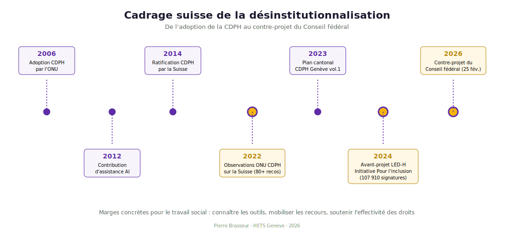

::: {.callout-tip icon=false appearance="default"}
## Au programme de cette séance

**Mouvement** · Cartographie politique I
**Question structurante** · Désinstitutionnaliser — pour qui, comment, à quelles conditions ?
**Durée** · 2 heures
**Lecture estimée** · 35 minutes

L'article 19 CDPH, sa lecture stricte par le Comité ONU, la position IASSIDD de Mansell-Beadle-Brown, les jalons suisses 2014-2026, et un angle mort essentiel : l'intersection handicap-migration.

À la fin, vous saurez **identifier les conditions de qualité** de la désinstitutionnalisation, **cartographier les jalons suisses**, **reconnaître les risques** de transinstitutionnalisation.

**Slides** · [reveal.js de la séance 4](../slides/04-slides.qmd)
:::

## Objectifs d'apprentissage

À l'issue de cette séance, l'étudiant·e sera capable de :

1. Comprendre le concept de **désinstitutionnalisation** et ses présupposés
2. Identifier la position **IASSIDD** [@mansell2010] sur les conditions de qualité
3. Cartographier les **jalons suisses 2014-2026** (CDPH, ONU 2022, plan cantonal, LED-H, Initiative *Pour l'inclusion*)
4. Reconnaître les risques de **transinstitutionnalisation** et de non-recours aggravé
5. Mobiliser l'**intersection handicap-migration** [@pierart2013] pour penser les angles morts

Compétences PEC20 ciblées : **C1, C2, C5, C7**.

## Plan minuté (2 h)

| Temps | Contenu | Activité |
|---|---|---|
| 0-10 min | Retour sur les carnets de bord (1-2 partages) | Tour de table |
| 10-25 min | **Article 19 CDPH et observations ONU 2022** sur la Suisse | Exposé |
| 25-45 min | **Mansell-Beadle-Brown (2010)** : la qualité ne dépend pas de la taille | Exposé |
| 45-60 min | **Jalons suisses 2014-2026** | Exposé + frise |
| 60-75 min | **Qui reste invisible ?** Intersection handicap-migration | Exposé |
| 75-100 min | ***Jigsaw*** : 3 textes / 3 sous-groupes | Travail collectif |
| 100-115 min | **Étude de cas** : Sureaux vs foyer EPI | Discussion |
| 115-120 min | Synthèse | Discussion |

## Cadre théorique

### L'article 19 CDPH et son interprétation

L'article 19 CDPH pose le droit de *« vivre dans la société, avec la même liberté de choix que les autres personnes »*. Il implique trois éléments :

1. **Choix du lieu de vie** et des personnes avec qui vivre
2. **Accès à des services d'assistance personnelle**
3. **Accès aux services généraux** sur la base de l'égalité

Le Comité ONU CDPH (Observation générale n° 5, 2017) interprète strictement : la désinstitutionnalisation suppose la fermeture des établissements résidentiels et leur remplacement par des services communautaires individualisés.

### Les observations finales sur la Suisse 2022

Le Comité ONU CDPH a examiné le rapport initial de la Suisse les 14-15 mars 2022 et publié ses observations le 13 avril 2022 [@onu2022].

> *« The Committee is concerned about the lack of a comprehensive deinstitutionalization strategy. »* (§ 41)
>
> *« Adopt a deinstitutionalization strategy with a clear time frame. »* (§ 42)

80+ recommandations au total. Inclusion Handicap a publié dans la foulée un communiqué *« La Suisse en mauvaise position »*.

### Mansell-Beadle-Brown : la qualité ne dépend pas de la taille

Jim Mansell et Julie Beadle-Brown formulent la position officielle IASSIDD [@mansell2010] :

> *« Community-based services are typically associated with better outcomes than institutional provision, but outcomes vary widely depending on how services are organised. »*
>
> --- @mansell2010, p. 106

::: {.callout-warning appearance="simple"}
## Implications
- La désinstitutionnalisation **n'est pas** la simple fermeture d'établissements
- Elle suppose un **investissement substantiel** dans les services de proximité
- Sans cet investissement, elle produit de la **transinstitutionnalisation** (déplacement vers d'autres formes de ségrégation) ou aggrave le **non-recours**
:::

### Le cas suisse 2014-2026

| Année | Évènement |
|---|---|
| 2014 | Ratification CDPH par la Suisse (15 avril) |
| 2022 | Observations finales du Comité ONU CDPH (80+ recommandations) |
| 2023 | Plan cantonal genevois CDPH, volume 1 (janvier) |
| 2024 | Avant-projet LED-H en consultation (12 juin) |
| 2024 | Initiative populaire fédérale *Pour l'inclusion* — **107 910 signatures** (5 septembre) |
| 2026 | Contre-projet du Conseil fédéral, message du 25 février |

### Qui sort-on de l'institution ? Qui reste invisible ?

L'**intersection handicap-migration** [@pierart2013] documente un angle mort : les familles migrantes confrontées au handicap d'un enfant cumulent des obstacles linguistiques, juridiques, culturels.

Conséquences :

- **Sous-représentation** dans les dispositifs d'aide précoce
- **Non-recours** structurel
- **Représentations culturelles** non thématisées dans la formation des TS
- **Médiation interculturelle** rarement systématisée

::: {.callout-tip appearance="simple"}
## Pour la pratique
Une stratégie de désinstitutionnalisation qui ne thématise pas ces angles morts laissera de côté les familles les plus précaires. Le TS doit articuler **droit à la communauté** (art. 19 CDPH) et **droit à la non-discrimination** (art. 5 CDPH).
:::

### Étude de cas : Sureaux vs foyer EPI

**Sureaux** (Chêne-Bougeries) : habitat coopératif inclusif. Partenariat Codha + Fondation Ensemble. 19 logements dont 3 réservés à Ensemble (~12 résidents avec DI). Chantier 2018, emménagement mars 2021. 1ᵉʳ prix Coopératives Habitat Suisse, catégorie « partenariat ». Cas d'école romand d'habitat inclusif.

**EPI — Établissements publics pour l'intégration** : > 2 000 personnes/an, > 40 lieux, structure historique d'accueil.

Question pour la classe : comment articuler ces deux modalités dans une stratégie cantonale de désinstitutionnalisation ?

## Lectures préparatoires (*jigsaw*)

::: panel-tabset

### Groupe A — Le cadre normatif

Comité ONU CDPH (2017), *Observation générale n° 5 sur l'article 19* (20 pages).

[@onu2022], **Sections sur l'article 19** (10 pages).

### Groupe B — La controverse scientifique

[@mansell2010] (9 pages).

Bigby & Beadle-Brown (2018), Improving quality of life outcomes (15 pages, compagnon FR).

### Groupe C — Le terrain suisse et ses angles morts

AGILE.CH (2023-2024), *Vie autodéterminée* (20 pages).

Inclusion Handicap (2022), *La Suisse en mauvaise position* (15 pages).

[@pierart2013], **introduction et 1 chapitre** (30 pages).

:::

## Auto-évaluation

::: {.callout-tip collapse="true"}
## Exercice : évaluer la qualité d'un habitat alternatif

Un foyer de 60 places se réorganise en 8 appartements de 4 personnes dans le même quartier. Quels indicateurs Mansell-Beadle-Brown vous permettent d'évaluer la qualité de cette réorganisation, au-delà de la simple « sortie de l'institution » ?

### Réponse

Indicateurs IASSIDD [@mansell2010] à vérifier :

- **Qualité de vie individuelle** : choix au quotidien, activités significatives, relations sociales
- **Inclusion dans la communauté** : usage des services ordinaires (commerces, transports, loisirs), participation civique
- **Autodétermination effective** : décisions sur le lieu, les colocataires, les routines
- ***Active support*** : accompagnement professionnel qui maximise l'engagement, pas le contrôle
- **Continuité des relations** : maintien des liens familiaux et amicaux

Sans cette évaluation, on peut très bien avoir **transinstitutionnalisation** : 8 mini-foyers fonctionnant comme un grand foyer, avec les mêmes routines, les mêmes asymétries de pouvoir, simplement répartis sur 8 sites.
:::

## Travail attendu pour la séance 5

Identifier un dispositif d'habitat ou d'accompagnement de votre canton de FP. Analyser en 1 page : relève-t-il d'une logique institutionnelle, communautaire, ou intermédiaire ? Quels indicateurs de qualité au sens de Mansell-Beadle-Brown ?

## Bibliographie complète de la séance

Voir Annexe C. Citations principales : @mansell2010, @onu2022, @pierart2013.

**Compléments** : AGILE.CH (2023-2024), *Vie autodéterminée*. Bigby & Beadle-Brown (2018). Comité ONU CDPH (2017), *Observation générale n° 5*. ENIL (2023). État de Genève DCS (2023, 2024). Inclusion Handicap (2022). Power (2013).

## Slides

[:material-presentation: Slides reveal.js de la séance 4](../slides/04-slides.qmd){.btn .btn-primary target="_blank"}
